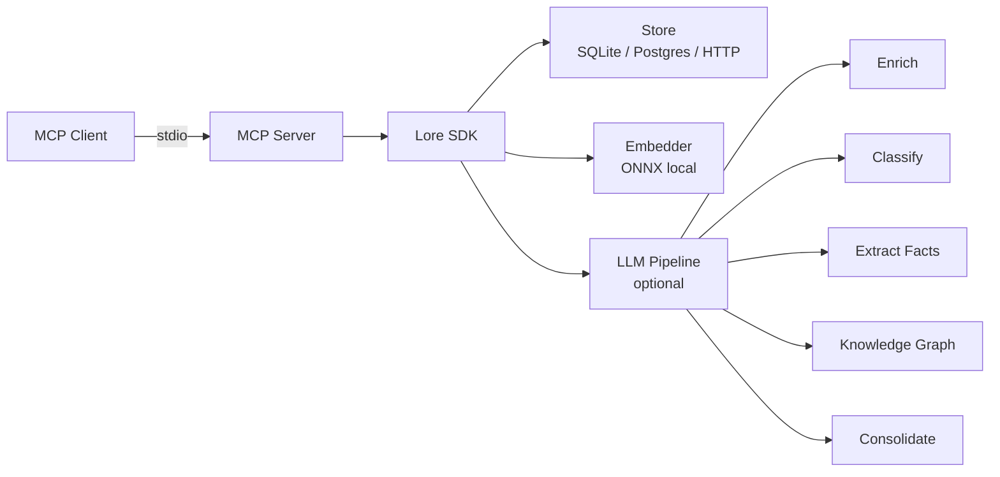

# Lore — Cross-Agent Memory for AI

[](https://pypi.org/project/lore-sdk/)
[](https://www.python.org/downloads/)
[](LICENSE)
[](https://modelcontextprotocol.io)
[](https://github.com/amitpaz1/lore/actions)

**Persistent semantic memory that works with every MCP-compatible AI tool.**

Agents store what they learn — other agents recall it. Knowledge graphs, fact extraction, auto-consolidation, and more. No API key required for basic use.

## Why Lore?

- **Local-first** — SQLite by default, no server needed. Scale to Postgres + pgvector when ready.
- **No API key required** — local ONNX embeddings ship with the package. LLM features are opt-in.
- **Single database** — no Neo4j, Redis, or Qdrant dependency. Everything in one SQLite file or Postgres DB.
- **20 MCP tools** — remember, recall, knowledge graph, fact extraction, consolidation, classification, and more.
- **Opt-in intelligence** — enrichment, classification, fact extraction, and knowledge graphs activate only when you configure an LLM.

## Comparison

| Feature | Lore | Mem0 | Zep | Cognee |
|---|---|---|---|---|
| Local-first (no server) | Yes | No | No | No |
| MCP native | Yes | No | No | No |
| Knowledge graph | Yes | Yes* | Yes | Yes |
| Fact extraction | Yes | No | No | Yes |
| Auto-consolidation | Yes | No | Yes | No |
| Conflict resolution | Yes | No | No | No |
| Memory tiers | Yes | No | Yes | No |
| Dialog classification | Yes | No | No | No |
| Webhook ingestion | Yes | No | No | No |
| No external DB required | Yes | No** | No | No |
| PII masking | Yes | No | No | No |

\* Mem0 requires Neo4j for graph features.
\*\* Mem0 requires Qdrant or Redis.

*Comparison as of March 2026. Lore focuses on being the MCP-native, local-first choice for agent memory.*

## Quick Start

### 1. Install (30 seconds)

```bash
pip install lore-sdk
```

### 2. Configure your AI tool (60 seconds)

Add to your MCP client config (e.g., Claude Desktop `claude_desktop_config.json`):

```json
{
  "mcpServers": {
    "lore": {
      "command": "uvx",
      "args": ["lore-memory"],
      "env": {
        "LORE_PROJECT": "my-project"
      }
    }
  }
}
```

See [Setup Guides](docs/mcp-setup.md) for Claude Desktop, Cursor, VS Code, Windsurf, ChatGPT, Cline, and Claude Code.

### 3. Try it (3 minutes)

Ask your AI assistant:

> "Remember that our API uses REST with JSON responses and rate limits at 100 req/min"

Then ask:

> "What do you know about our API?"

Lore's `recall` tool will be invoked automatically.

### 4. Enable LLM features (optional)

```bash
export LORE_ENRICHMENT_ENABLED=true
export LORE_LLM_PROVIDER=anthropic
export LORE_LLM_API_KEY=sk-ant-...
```

This enables auto-enrichment (topics, entities, sentiment), classification (intent, domain, emotion), and fact extraction on every `remember()` call.

### 5. Use the SDK directly

```python
from lore import Lore

lore = Lore()  # zero config — local SQLite, built-in embeddings

lore.remember(
    "Stripe API returns 429 after 100 req/min — use exponential backoff",
    tags=["stripe", "rate-limit"],
    tier="long",
)

results = lore.recall("stripe rate limiting")
for r in results:
    print(f"[{r.score:.2f}] {r.memory.content}")
```

> [Full Quick Start Guide](docs/quickstart.md)

## Architecture



**Pipeline:** `remember()` → redact PII → embed → store → enrich → classify → extract facts → update graph

**Recall:** `recall()` → embed query → vector search → tier weighting → importance scoring → graph boost → return results

> [Full Architecture Documentation](docs/architecture.md)

## Features

### Memory Management
**remember** · **recall** · **forget** · **list_memories** · **stats** · **upvote** · **downvote**

Core memory operations with semantic search, tier-based TTL (working/short/long), importance scoring, and automatic PII redaction.

### Knowledge Graph
**graph_query** · **entity_map** · **related**

Entities and relationships extracted from memories, with hop-by-hop traversal. Graph-enhanced recall surfaces connected memories that pure vector search misses.

### Fact Extraction & Conflicts
**extract_facts** · **list_facts** · **conflicts**

Atomic (subject, predicate, object) triples extracted from text. Automatic conflict detection when new facts contradict old ones — supersede, merge, or flag.

### Intelligence Pipeline
**classify** · **enrich** · **consolidate**

LLM-powered classification (intent/domain/emotion), metadata enrichment (topics/entities/sentiment), and memory consolidation (merge duplicates, summarize clusters).

### Import/Export
**ingest** · **as_prompt** · **check_freshness** · **github_sync**

Webhook-style ingestion with source tracking. Export memories formatted for LLM context injection. Git-based staleness detection. GitHub issue/PR sync.

## Setup Guides

| Client | Guide |
|--------|-------|
| Claude Desktop | [docs/setup-claude-desktop.md](docs/setup-claude-desktop.md) |
| Cursor | [docs/setup-cursor.md](docs/setup-cursor.md) |
| VS Code (Copilot) | [docs/setup-vscode.md](docs/setup-vscode.md) |
| Windsurf | [docs/setup-windsurf.md](docs/setup-windsurf.md) |
| ChatGPT | [docs/setup-chatgpt.md](docs/setup-chatgpt.md) |
| Cline | [docs/setup-cline.md](docs/setup-cline.md) |
| Claude Code | [docs/setup-claude-code.md](docs/setup-claude-code.md) |

> [All Setup Guides](docs/mcp-setup.md)

## Docker

For team setups with Postgres + pgvector:

```bash
docker compose up -d
```

This starts Postgres with pgvector and the Lore HTTP server. Point your MCP client to `http://localhost:8765`.

```bash
# Production (with secure password)
cp .env.example .env  # edit POSTGRES_PASSWORD
docker compose -f docker-compose.prod.yml up -d
```

> [Self-Hosted Guide](docs/self-hosted.md)

## API Reference

- [MCP Tools (20 tools)](docs/api-reference.md#mcp-tools)
- [CLI Commands](docs/api-reference.md#cli-commands)
- [SDK Methods](docs/api-reference.md#sdk-lore-class)
- [Environment Variables](docs/api-reference.md#environment-variables)

> [Full API Reference](docs/api-reference.md)

## Performance

| Operation | Target |
|---|---|
| `remember()` no LLM | < 100ms |
| `recall()` vector search (100 memories) | < 50ms |
| `recall()` vector search (10K memories) | < 200ms |
| `recall()` graph-enhanced (2-hop) | < 500ms |
| Embedding generation (500 words) | < 200ms |
| `as_prompt()` 100 memories | < 100ms |

> [Benchmark Results](docs/benchmarks.md)

## Migration from v0.5.x

v0.6.0 adds 13 new MCP tools (7 → 20), new database columns and tables, and opt-in LLM features. Existing installations work without changes — all new features are opt-in.

> [Migration Guide](docs/migration-v0.5-to-v0.6.md)

## Examples

See [`examples/`](examples/) for runnable scripts:

- [`full_pipeline.py`](examples/full_pipeline.py) — remember, recall, tiers, prompt export
- [`mcp_tool_tour.py`](examples/mcp_tool_tour.py) — tour of all 20 MCP tool equivalents
- [`webhook_ingestion.py`](examples/webhook_ingestion.py) — ingest with source tracking
- [`consolidation_demo.py`](examples/consolidation_demo.py) — memory consolidation

## Contributing

```bash
git clone https://github.com/amitpaz1/lore.git
cd lore
pip install -e ".[dev,mcp,enrichment]"
pytest
```

## License

MIT
