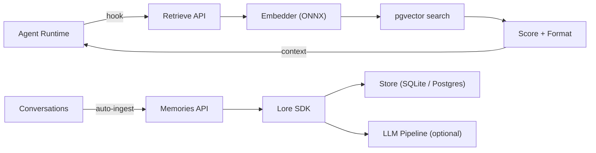

# Lore — Memory That Works Without Code Changes

[](https://pypi.org/project/lore-sdk/)
[](https://www.python.org/downloads/)
[](LICENSE)
[](https://modelcontextprotocol.io)
[](https://github.com/agentkitai/lore/actions)

**Install a hook. Your agent remembers.**

Lore auto-injects relevant memories into your agent's context before every response. No SDK calls. No agent cooperation. No code changes. Just a hook and a server.

```
User: "What API rate limits should I use?"

── Lore hook fires (20ms) ──────────────────────────────
🧠 Relevant memories:
- [0.82] Stripe API returns 429 after 100 req/min — use exponential backoff
- [0.71] Our internal API rate limit is 500 req/min per API key
────────────────────────────────────────────────────────

Agent sees memories + prompt → responds with full context
```

Your agent didn't call anything. Lore queried itself, found relevant memories, and injected them — all before the agent saw the message.

## Why Not MCP Tools?

MCP memory tools (including Lore's own 20 MCP tools) rely on the agent *choosing* to call `recall()`. In practice, agents rarely do. Memory becomes write-only — a fancy notebook nobody reads.

**Auto-retrieval fixes this structurally.** Every message triggers a semantic search. Relevant memories appear in context automatically. The agent doesn't need to know Lore exists.

## Quick Start — Claude Code (2 minutes)

### 1. Start the Lore server

```bash
pip install lore-sdk
lore serve  # starts on port 8765, SQLite by default
```

### 2. Add the hook

Create `~/.claude/hooks/lore-retrieve.sh`:

```bash
#!/bin/bash
# Auto-inject Lore memories into every Claude Code prompt
INPUT=$(cat)
PROMPT=$(echo "$INPUT" | jq -r '.prompt // empty')

# Skip short/empty prompts
[ -z "$PROMPT" ] || [ ${#PROMPT} -lt 10 ] && exit 0

ENCODED=$(printf '%s' "$PROMPT" | jq -sRr @uri)
RESPONSE=$(curl -s --max-time 2 \
  "http://localhost:8765/v1/retrieve?query=${ENCODED}&limit=5&min_score=0.3&format=markdown" \
  -H "Authorization: Bearer ${LORE_API_KEY}" 2>/dev/null)

COUNT=$(echo "$RESPONSE" | jq -r '.count // 0' 2>/dev/null)
if [ "$COUNT" -gt 0 ]; then
  FORMATTED=$(echo "$RESPONSE" | jq -r '.formatted // empty' 2>/dev/null)
  jq -n --arg ctx "🧠 Relevant memories from Lore:
$FORMATTED" '{
    hookSpecificOutput: {
      hookEventName: "UserPromptSubmit",
      additionalContext: $ctx
    }
  }'
fi
```

```bash
chmod +x ~/.claude/hooks/lore-retrieve.sh
```

Add to `~/.claude/settings.json`:

```json
{
  "hooks": {
    "UserPromptSubmit": [
      {
        "hooks": [
          {
            "type": "command",
            "command": "~/.claude/hooks/lore-retrieve.sh"
          }
        ]
      }
    ]
  }
}
```

### 3. Done

Every prompt you type in Claude Code now gets relevant memories injected automatically. Store memories via MCP tools, the SDK, or the REST API — they'll surface when relevant.

## How It Works

```
┌─────────────┐     ┌──────────────┐     ┌──────────────┐
│ User types   │────▶│ Hook fires   │────▶│ Lore server  │
│ a prompt     │     │ (pre-agent)  │     │ /v1/retrieve │
└─────────────┘     └──────┬───────┘     └──────┬───────┘
                           │                     │
                    memories injected      semantic search
                    into agent context     (pgvector/ONNX)
                           │                     │
                    ┌──────▼───────┐     ┌──────▼───────┐
                    │ Agent sees   │     │ Top-K results │
                    │ prompt +     │◀────│ scored &      │
                    │ memories     │     │ formatted     │
                    └──────────────┘     └──────────────┘
```

**Key properties:**
- **20ms latency** (warm) — faster than a network round-trip
- **Fail-open** — if Lore is slow or down, the agent responds normally
- **Per-message** — every prompt gets fresh context, not just session start
- **No agent cooperation** — the agent doesn't know Lore exists

## Supported Runtimes

| Runtime | Hook Type | Status |
|---------|-----------|--------|
| **Claude Code** | `UserPromptSubmit` | ✅ Ready |
| **OpenClaw** | `message:preprocessed` | ✅ Ready |
| **Any HTTP client** | `GET /v1/retrieve` | ✅ Ready |

The `/v1/retrieve` endpoint works with any system that can make an HTTP call before sending a prompt to an LLM. If your runtime supports pre-prompt hooks, Lore plugs right in.

> [Claude Code Setup](docs/setup-claude-code.md) · [OpenClaw Setup](docs/setup-openclaw.md) · [API Reference](docs/api-reference.md)

## Storing Memories

Memories flow in automatically or manually:

### Auto-ingest (conversations → memories)
Hook into your agent's message stream. Lore extracts facts, preferences, and decisions from conversations automatically.

### MCP Tools (20 tools)
```
"Remember that our API uses REST with rate limits at 100 req/min"
```
Your agent calls `remember()` via MCP. Works with Claude Desktop, Cursor, VS Code, Windsurf, ChatGPT, Cline, and Claude Code.

### REST API
```bash
curl -X POST http://localhost:8765/v1/memories \
  -H "Authorization: Bearer $LORE_API_KEY" \
  -d '{"content": "API rate limit is 100 req/min", "tags": ["api"]}'
```

### SDK
```python
from lore import Lore

lore = Lore()  # zero config — local SQLite, built-in embeddings
lore.remember("API rate limit is 100 req/min", tags=["api"])
```

## Comparison

| Feature | Lore | Mem0 | Zep |
|---|---|---|---|
| **Auto-retrieval hooks** | **Yes** | No | No |
| **No code changes needed** | **Yes** | No | No |
| Local-first (no server) | Yes | No | No |
| MCP native (20 tools) | Yes | No | No |
| Knowledge graph | Yes | Yes* | Yes |
| Fact extraction | Yes | No | No |
| Auto-consolidation | Yes | No | Yes |
| Memory tiers + decay | Yes | No | Yes |
| Self-hosted | Yes | Partial | Partial |
| No external DB required | Yes | No** | No |

\* Mem0 requires Neo4j for graph features.
\*\* Mem0 requires Qdrant or Redis.

**The difference:** Mem0 and Zep are SDKs — you write the `search()` → inject → `add()` code yourself. Lore is a runtime plugin — install a hook, memories flow automatically.

## Installation

### Local (SQLite, zero config)

```bash
pip install lore-sdk
lore serve
```

Everything runs locally. ONNX embeddings ship with the package. No API keys needed.

### Docker (Postgres + pgvector)

```bash
docker compose up -d
```

Starts Postgres with pgvector and the Lore HTTP server on port 8765.

```bash
# Production
cp .env.example .env  # edit POSTGRES_PASSWORD and LORE_ROOT_KEY
docker compose -f docker-compose.prod.yml up -d
```

> [Self-Hosted Guide](docs/self-hosted.md)

### npm (TypeScript SDK)

```bash
npm install lore-sdk
```

## Features

### Auto-Retrieval (v0.8.3)
**GET /v1/retrieve** · **runtime hooks** · **fail-open design**

The headline feature. Semantic search + formatted output designed for prompt injection. Supports XML, Markdown, and raw JSON formats. Configurable score threshold, result limit, and timeout.

### Memory Management
**remember** · **recall** · **forget** · **list_memories** · **stats** · **upvote** · **downvote**

Core operations with semantic search, tier-based TTL (working/short/long), importance scoring with temporal decay, and automatic PII redaction.

### Knowledge Graph
**graph_query** · **entity_map** · **related**

Entities and relationships extracted from memories, with hop-by-hop traversal. Graph-enhanced recall surfaces connected memories that pure vector search misses.

### Fact Extraction & Conflicts
**extract_facts** · **list_facts** · **conflicts**

Atomic (subject, predicate, object) triples extracted from text. Automatic conflict detection when new facts contradict old ones.

### Intelligence Pipeline
**classify** · **enrich** · **consolidate**

LLM-powered classification, metadata enrichment, and memory consolidation. All opt-in — requires an LLM API key.

### Temporal Queries (v0.7.0)
**on_this_day** · **verbatim recall** · **temporal filters**

Surface memories from the same day across years. Return original words. Filter by date ranges.

### Import/Export
**ingest** · **as_prompt** · **check_freshness** · **github_sync**

Webhook-style ingestion, LLM-formatted export, staleness detection, and GitHub sync.

## MCP Setup Guides

| Client | Guide |
|--------|-------|
| Claude Desktop | [docs/setup-claude-desktop.md](docs/setup-claude-desktop.md) |
| Claude Code | [docs/setup-claude-code.md](docs/setup-claude-code.md) |
| Cursor | [docs/setup-cursor.md](docs/setup-cursor.md) |
| VS Code (Copilot) | [docs/setup-vscode.md](docs/setup-vscode.md) |
| Windsurf | [docs/setup-windsurf.md](docs/setup-windsurf.md) |
| ChatGPT | [docs/setup-chatgpt.md](docs/setup-chatgpt.md) |
| Cline | [docs/setup-cline.md](docs/setup-cline.md) |

> [All Setup Guides](docs/mcp-setup.md)

## API Reference

- [Auto-Retrieval API](docs/api-reference.md#auto-retrieval)
- [MCP Tools (20 tools)](docs/api-reference.md#mcp-tools)
- [CLI Commands](docs/api-reference.md#cli-commands)
- [SDK Methods](docs/api-reference.md#sdk-lore-class)
- [Environment Variables](docs/api-reference.md#environment-variables)

> [Full API Reference](docs/api-reference.md)

## Performance

| Operation | Latency |
|---|---|
| `/v1/retrieve` (warm) | ~20ms |
| `remember()` no LLM | < 100ms |
| `recall()` 100 memories | < 50ms |
| `recall()` 10K memories | < 200ms |
| `recall()` graph-enhanced | < 500ms |
| Embedding (500 words) | < 200ms |

## Architecture



> [Full Architecture Documentation](docs/architecture.md)

## Examples

See [`examples/`](examples/) for runnable scripts:

- [`full_pipeline.py`](examples/full_pipeline.py) — remember, recall, tiers, prompt export
- [`mcp_tool_tour.py`](examples/mcp_tool_tour.py) — tour of all 20 MCP tools
- [`webhook_ingestion.py`](examples/webhook_ingestion.py) — ingest with source tracking
- [`consolidation_demo.py`](examples/consolidation_demo.py) — memory consolidation

## Contributing

```bash
git clone https://github.com/agentkitai/lore.git
cd lore
pip install -e ".[dev,mcp,enrichment]"
pytest
```

## License

MIT
