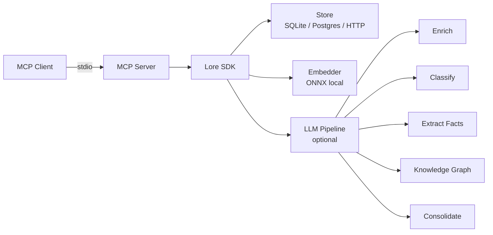
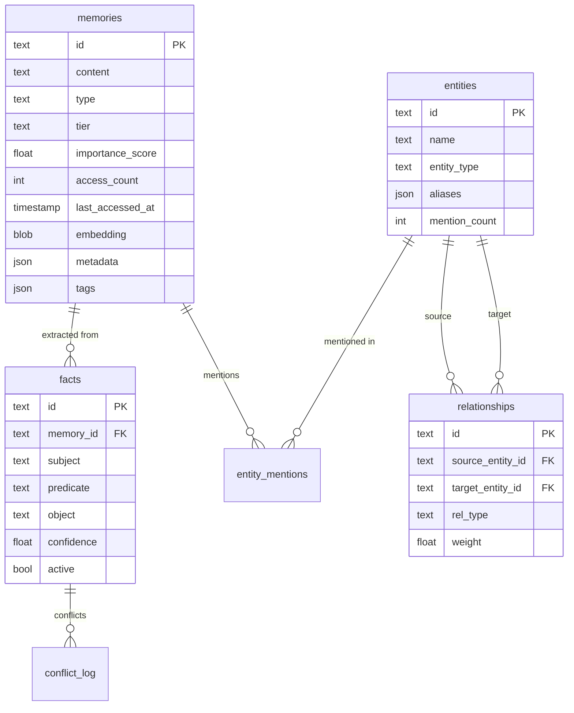

# F8 — Cross-Tool Docs + Integration: Architecture

**Feature:** F8 — Documentation, Integration Tests, Polish
**Version:** v0.6.0 ("Open Brain")
**Status:** Ready for Implementation
**PRD:** `_bmad-output/planning-artifacts/f08-cross-tool-docs-prd.md`

---

## 1. Scope & Principles

F8 adds zero new functionality. It wraps all v0.6.0 features (F1-F7, F9, F10) with documentation, integration tests, benchmarks, and packaging polish. Every deliverable is a file — no runtime code changes except MCP tool description improvements and `pyproject.toml` metadata.

**Design principles:**
1. **Test first** — Integration tests may reveal cross-feature bugs. Write and run them before documenting behavior.
2. **Docs as code** — All documentation lives in the repo as Markdown. No hosted site for v0.6.0.
3. **Honest positioning** — Competitive comparisons use footnotes for nuance. Never misrepresent competitors.
4. **Copy-pasteable** — Every setup guide includes exact config snippets, not prose descriptions of what to type.
5. **Incremental verification** — Each phase is independently testable. No big-bang integration at the end.

---

## 2. File Structure

```
/
├── README.md                           # Complete rewrite (section 3)
├── CHANGELOG.md                        # v0.6.0 changelog (section 9)
├── docker-compose.yml                  # Already exists — update for local dev docs
├── docker-compose.prod.yml             # Already exists — for production docs
├── pyproject.toml                      # Metadata updates (section 10)
│
├── docs/
│   ├── quickstart.md                   # 5-minute getting started (section 4)
│   ├── architecture.md                 # Architecture diagram + explanation (section 5)
│   ├── api-reference.md                # Already exists — rewrite/expand (section 6)
│   ├── migration-v0.5-to-v0.6.md       # Migration guide (section 7)
│   ├── benchmarks.md                   # Performance results (section 8)
│   ├── mcp-setup.md                    # Already exists — rewrite as index
│   ├── setup-claude-desktop.md         # Per-client setup guides
│   ├── setup-cursor.md                 #   (section 4.2)
│   ├── setup-vscode.md
│   ├── setup-windsurf.md
│   ├── setup-chatgpt.md
│   ├── setup-cline.md
│   ├── setup-claude-code.md
│   └── self-hosted.md                  # Already exists — update
│
├── examples/
│   ├── full_pipeline.py                # Full cognitive pipeline demo
│   ├── mcp_tool_tour.py                # All 20 MCP tools demo
│   ├── webhook_ingestion.py            # Webhook ingestion demo
│   └── consolidation_demo.py           # Consolidation demo
│
├── tests/integration/
│   ├── __init__.py                     # Already exists
│   ├── conftest.py                     # Shared fixtures (section 11.1)
│   ├── test_full_pipeline.py           # Scenario 1
│   ├── test_graph_recall.py            # Scenario 2
│   ├── test_fact_conflicts.py          # Scenario 3
│   ├── test_consolidation_graph.py     # Scenario 4
│   ├── test_webhook_recall.py          # Scenario 5
│   ├── test_prompt_export.py           # Scenario 6
│   ├── test_tier_lifecycle.py          # Scenario 7
│   ├── test_entity_map.py             # Scenario 8
│   ├── test_cross_feature_filters.py   # Scenario 9
│   ├── test_no_llm_mode.py            # Scenario 10
│   └── test_remote.py                  # Already exists — unchanged
│
└── benchmarks/
    └── run_benchmarks.py               # Benchmark runner (section 8)
```

---

## 3. README Structure

The README is rewritten top-to-bottom. Structure optimized for the "30-second scan" pattern: badge bar → one-liner → why → matrix → quick start → details.

```markdown
# Lore — Cross-Agent Memory for AI

[badges: PyPI version, Python 3.9+, License MIT, MCP compatible]

One-liner: Persistent semantic memory that works with every MCP-compatible AI tool.

## Why Lore?
[5 bullet points — local-first, no API key, single DB, 20 MCP tools, opt-in LLM features]

## Comparison
[Feature matrix table: Lore vs Mem0 vs Zep vs Cognee — from PRD section 4.1]
[Footnotes for nuance on competitor capabilities]

## Quick Start
[Embedded from docs/quickstart.md — install, configure, try it, enable LLM]

## Architecture
[Mermaid diagram showing: MCP Client → MCP Server → Lore SDK → Store + Embedder + LLM Pipeline]
[Brief paragraph explaining the pipeline: remember → enrich → classify → extract → graph]

## Features
[Brief description of each feature area with links to relevant tools]

## Setup Guides
[Links to docs/setup-*.md for each client]

## Docker
[docker compose up instructions — reference existing docker-compose.yml]

## API Reference
[Link to docs/api-reference.md]

## Performance
[Summary table of key benchmarks with link to docs/benchmarks.md]

## Migration from v0.5.x
[Link to docs/migration-v0.5-to-v0.6.md]

## Contributing
[Brief contribution instructions]

## License
MIT
```

**Architecture diagram (Mermaid):**



This renders natively on GitHub. No external images needed.

---

## 4. Setup Guides Architecture

### 4.1 Template Structure

Every setup guide follows an identical 5-section template. This is not an abstract base — it's a literal Markdown structure that each guide must implement.

```markdown
# Setting Up Lore with [Client Name]

## Prerequisites
- Python 3.9+
- [Client-specific prerequisites]

## Configuration

### Local Mode (SQLite — zero setup)
[Exact JSON config block]

### Remote Mode (Lore Cloud / self-hosted)
[Exact JSON config block]

## Verify It Works
1. Open [client]
2. Ask: "Remember that our API uses REST with JSON responses"
3. Ask: "What do you know about our API?"
4. You should see Lore's recall tool being invoked.

## Enable LLM Features (Optional)
[Config with LORE_ENRICHMENT_ENABLED=true, etc.]

## Troubleshooting
| Problem | Solution |
|---------|----------|
| [Common issue 1] | [Fix] |
| [Common issue 2] | [Fix] |
```

### 4.2 Client-Specific Details

| Client | Config File | Launch Command | Notes |
|--------|------------|----------------|-------|
| Claude Desktop | `~/Library/Application Support/Claude/claude_desktop_config.json` (macOS) | `uvx lore-memory` | Primary audience. Most detailed guide. |
| Cursor | `.cursor/mcp.json` | `uvx lore-memory` | Project-scoped config. |
| VS Code | `.vscode/mcp.json` | `uvx lore-memory` | Copilot MCP extension required. |
| Windsurf | `~/.codeium/windsurf/mcp_config.json` | `uvx lore-memory` | Global config. |
| ChatGPT | Via MCP bridge | `uvx lore-memory` | Mark as experimental. |
| Cline | `.cline/mcp_settings.json` | `uvx lore-memory` | Project-scoped. |
| Claude Code | `.claude/settings.json` or `CLAUDE.md` | `uvx lore-memory` | Document both methods. |

### 4.3 Existing `docs/mcp-setup.md` Rewrite

The existing `mcp-setup.md` references outdated tool names (`save_lesson`, `recall_lessons`) and only covers Claude Desktop and OpenClaw. Rewrite it as an **index page** linking to per-client guides, with the common environment variables table.

---

## 5. Architecture Documentation

`docs/architecture.md` covers the system design for users who want to understand how Lore works internally.

**Structure:**

```markdown
# Architecture

## Overview
[Mermaid diagram — same as README but expanded with internal modules]

## Data Model
[Entity-relationship diagram showing: Memory, Fact, Entity, Relationship, ConflictEntry tables]

## Pipeline: remember()
[Step-by-step flow: redact → embed → store → enrich → classify → extract facts → graph]

## Pipeline: recall()
[Step-by-step flow: embed query → vector search → tier weighting → importance scoring → graph enhancement → format]

## Storage Backends
[SQLite (local), Postgres+pgvector (server), HTTP (remote client)]

## Embedding
[ONNX local embedder, dual embedding for code, routing logic]

## LLM Integration
[Optional features, litellm provider, env var configuration]

## Knowledge Graph
[Entity/relationship storage in SQLite, app-level traversal, co-occurrence edges]
```

**Data model diagram (Mermaid):**



---

## 6. API Reference Architecture

`docs/api-reference.md` is the canonical reference for all public interfaces. It already exists but needs a complete rewrite to cover 20 MCP tools (up from the previous set).

**Structure:**

```markdown
# API Reference

## MCP Tools (20 tools)

### Memory Management
- remember — Store a memory
- recall — Semantic search
- forget — Delete a memory
- list_memories — List memories
- stats — Memory statistics
- upvote_memory — Boost ranking
- downvote_memory — Lower ranking

### Knowledge & Facts
- extract_facts — Extract SPO triples from text
- list_facts — List active facts
- conflicts — View fact conflicts

### Knowledge Graph
- graph_query — Traverse the graph
- entity_map — List entities
- related — Find related memories/entities

### Intelligence Pipeline
- classify — Classify text intent/domain/emotion
- enrich — Add LLM-extracted metadata
- consolidate — Merge/summarize memories

### Import/Export
- ingest — Webhook-style ingestion
- as_prompt — Export for LLM context
- check_freshness — Git staleness check
- github_sync — Sync GitHub data

## CLI Commands
[lore remember, recall, forget, list, stats, prompt, consolidate, classify, ingest, ...]

## SDK (Lore class)
[Public methods with signatures, parameters, return types]

## Environment Variables
[Complete table of all LORE_* environment variables]
```

**Per-tool documentation template:**

```markdown
### `tool_name`

**Description:** [First sentence — the auto-discovery text]

**Parameters:**

| Parameter | Type | Required | Default | Description |
|-----------|------|----------|---------|-------------|
| ... | ... | ... | ... | ... |

**Returns:** [Description + example output]

**Example:**
[Code block showing tool invocation and response]
```

**Source of truth for tool parameters:** `src/lore/mcp/server.py`. The API reference must match the actual function signatures. During implementation, extract parameter info directly from the source rather than copying from this architecture doc.

---

## 7. Migration Guide Architecture

`docs/migration-v0.5-to-v0.6.md` covers upgrading from v0.5.x.

**Structure:**

```markdown
# Migrating from v0.5.x to v0.6.0

## What Changed
[Brief overview — 13 new tools, new data model fields, new tables]

## Automatic Migration
[Lore auto-migrates SQLite schemas on startup. No action needed for most users.]

## Schema Changes

### New Columns on `memories` Table
| Column | Type | Default | Purpose |
|--------|------|---------|---------|
| tier | VARCHAR(10) | 'long' | Memory tier (working/short/long) |
| importance_score | FLOAT | 1.0 | Adaptive importance |
| access_count | INT | 0 | Access tracking |
| last_accessed_at | TIMESTAMP | NULL | Last recall time |

### New Tables
[facts, conflict_log, entities, relationships, entity_mentions — brief description of each]

## Manual Migration SQL
[For users managing their own schemas — idempotent ALTER TABLE + CREATE TABLE IF NOT EXISTS statements]

## New MCP Tools (7 -> 20)
[Table: tool name, feature, one-line description]

## Breaking Changes
[recall() return format changes, new metadata fields]

## Deprecations
[decay_similarity_weight, decay_freshness_weight — deprecated, ignored]

## Troubleshooting
[Common upgrade issues and fixes]
```

---

## 8. Performance Benchmark Framework

### 8.1 Runner Script: `benchmarks/run_benchmarks.py`

```python
"""
Lore v0.6.0 Performance Benchmarks

Usage:
    python benchmarks/run_benchmarks.py [--store sqlite|memory] [--output docs/benchmarks.md]

Runs each benchmark scenario 10 times, reports median and p95 latency.
"""
```

**Architecture:**

```
benchmarks/
└── run_benchmarks.py       # Single script — no framework overhead
```

**Decision: Single file, not a framework.** Benchmarks are run manually and infrequently. A framework with plugins, decorators, and config files is overengineered. One Python script with functions is sufficient.

**Benchmark functions:**

```python
def bench_remember_no_llm(store, embedder, n=10) -> BenchResult:
    """remember() with embedding only — no LLM pipeline."""

def bench_remember_full_pipeline(lore, n=10) -> BenchResult:
    """remember() with enrich + classify + extract facts."""

def bench_recall_vector_100(store, embedder, n=10) -> BenchResult:
    """recall() vector-only search over 100 memories."""

def bench_recall_vector_10k(store, embedder, n=10) -> BenchResult:
    """recall() vector-only search over 10,000 memories."""

def bench_recall_graph_enhanced(lore, n=10) -> BenchResult:
    """recall() with 2-hop graph traversal."""

def bench_consolidate_50(lore, n=3) -> BenchResult:
    """consolidate() over 50 memories."""

def bench_as_prompt_100(lore, n=10) -> BenchResult:
    """as_prompt() formatting 100 memories."""

def bench_ingest_single(lore, n=10) -> BenchResult:
    """ingest() single item with enrichment."""

def bench_embedding_generation(embedder, n=10) -> BenchResult:
    """Embed a 500-word text."""

def bench_graph_entity_map(lore, n=10) -> BenchResult:
    """entity_map query over 1000 entities."""
```

**`BenchResult` is a simple dataclass:**

```python
@dataclasses.dataclass
class BenchResult:
    name: str
    iterations: int
    median_ms: float
    p95_ms: float
    target_ms: float  # from PRD
```

**Output:** The script prints a Markdown table and optionally writes to `docs/benchmarks.md`.

### 8.2 Results Documentation: `docs/benchmarks.md`

```markdown
# Performance Benchmarks

## Test Environment
[Hardware specs, Python version, OS, Lore version]

## Results

| Operation | Median | P95 | Target | Status |
|-----------|--------|-----|--------|--------|
| remember() no LLM | Xms | Xms | <100ms | PASS/FAIL |
| ... | ... | ... | ... | ... |

## Methodology
[10 iterations, time.perf_counter(), median/p95 reporting]

## Notes
[LLM benchmarks depend on provider latency, ONNX cold start, etc.]
```

### 8.3 LLM Benchmark Strategy

LLM-dependent benchmarks (remember with full pipeline, consolidation) are inherently variable due to API latency. Strategy:

1. **Mock LLM for reproducible benchmarks** — Use deterministic mock responses to measure Lore's own overhead.
2. **Real LLM for representative benchmarks** — Optional flag `--real-llm` to include actual API calls. Results documented separately with provider noted.
3. **Report both** — "Lore overhead: Xms" + "End-to-end with [provider]: Xms".

---

## 9. CHANGELOG Generation Strategy

**Approach: Hand-written, not auto-generated.** Auto-generated changelogs from commit messages produce noise. The v0.6.0 changelog is a curated summary.

**Source material:**
- Feature PRDs (F1-F10) for "Added" entries
- `git log v0.5.1..HEAD` for completeness check
- `src/lore/types.py` for data model changes
- `src/lore/mcp/server.py` for tool inventory

**Format:** [Keep a Changelog](https://keepachangelog.com/en/1.1.0/)

**CHANGELOG.md structure:**

```markdown
# Changelog

All notable changes to this project will be documented in this file.

## [0.6.0] — 2026-03-XX — "Open Brain"

### Added
[One entry per feature: F1-F7, F9, F10 — each with tool names]
[Docker Compose setup]
[Setup guides for 7 MCP clients]
[Integration test suite]
[Performance benchmarks]

### Changed
[recall() graph-enhanced mode]
[remember() enrichment pipeline]
[list_memories() new filters]
[stats() graph statistics]
[Memory data model extensions]

### Deprecated
[decay_similarity_weight, decay_freshness_weight]

### Migration Notes
[Link to migration guide]

## [0.5.1] — [date]
[Existing entries if any]
```

---

## 10. Package Metadata Updates

### 10.1 `pyproject.toml` Changes

```toml
[project]
version = "0.6.0"
description = "Cross-agent semantic memory with knowledge graphs, fact extraction, and MCP integration"
keywords = [
    "agent", "memory", "lore", "knowledge",
    "knowledge-graph", "fact-extraction", "memory-consolidation",
    "mcp", "model-context-protocol",
    "cognitive-memory", "ai-memory", "semantic-memory", "agent-memory",
]
classifiers = [
    "Development Status :: 4 - Beta",
    "License :: OSI Approved :: MIT License",
    "Programming Language :: Python :: 3",
    "Programming Language :: Python :: 3.9",
    "Programming Language :: Python :: 3.11",
    "Programming Language :: Python :: 3.12",
    "Topic :: Scientific/Engineering :: Artificial Intelligence",
    "Topic :: Software Development :: Libraries :: Python Modules",
]
```

### 10.2 `project.urls` Update

```toml
[project.urls]
Homepage = "https://github.com/amitpaz1/lore"
Repository = "https://github.com/amitpaz1/lore"
Documentation = "https://github.com/amitpaz1/lore/tree/main/docs"
Issues = "https://github.com/amitpaz1/lore/issues"
Changelog = "https://github.com/amitpaz1/lore/blob/main/CHANGELOG.md"
```

---

## 11. Integration Test Suite Architecture

### 11.1 Shared Fixtures (`tests/integration/conftest.py`)

```python
"""Shared fixtures for v0.6.0 integration tests.

All integration tests use MemoryStore (in-memory) by default for speed.
A separate conftest marker enables SqliteStore for schema verification.
LLM calls are mocked with deterministic responses.
"""
import pytest
from lore.lore import Lore
from lore.store.memory import MemoryStore

@pytest.fixture
def memory_store():
    """Fresh in-memory store for each test."""
    return MemoryStore()

@pytest.fixture
def lore_no_llm(memory_store):
    """Lore instance with no LLM features — baseline mode."""
    return Lore(store=memory_store, redact=False)

@pytest.fixture
def lore_full(memory_store, mock_llm):
    """Lore with all features enabled (LLM mocked)."""
    return Lore(
        store=memory_store,
        redact=False,
        classify=True,
        enrichment=True,
        fact_extraction=True,
        knowledge_graph=True,
        graph_depth=2,
        llm_provider="mock",
        # ... mock config
    )

@pytest.fixture
def mock_llm(monkeypatch):
    """Mock LLM responses for deterministic tests."""
    # Patches litellm.completion / litellm.acompletion
    # Returns canned responses for enrichment, classification,
    # fact extraction, consolidation prompts
    ...
```

**Key design decisions:**

1. **MemoryStore for speed.** Integration tests exercise feature interactions, not storage backends. MemoryStore avoids SQLite file I/O.
2. **SqliteStore for schema verification.** A subset of tests (or a separate pytest marker) run with SqliteStore to verify that new columns/tables work correctly with real SQL.
3. **Mocked LLM.** All LLM calls return deterministic canned responses. This makes tests reproducible and fast. The mock responses are realistic enough to exercise the parsing/processing logic.
4. **No Docker dependency.** Integration tests run in CI without Docker. The existing `@pytest.mark.integration` marker is for server-level tests requiring the full stack.

### 11.2 Test Scenario Details

Each test file maps to one PRD scenario. Test functions within each file cover the specific assertions.

**Scenario 1: Full Ingestion Pipeline** (`test_full_pipeline.py`)
```python
class TestFullIngestionPipeline:
    """Features tested: F4 (tiers), F5 (importance), F6 (enrichment),
    F9 (classification), F2 (fact extraction)."""

    def test_remember_triggers_enrichment(self, lore_full):
        """remember() with LLM features stores enrichment metadata."""

    def test_remember_assigns_tier(self, lore_full):
        """Tier parameter is persisted correctly."""

    def test_remember_computes_importance(self, lore_full):
        """Initial importance score is computed and stored."""

    def test_remember_extracts_facts(self, lore_full):
        """Facts are extracted and stored in facts table."""

    def test_remember_classifies(self, lore_full):
        """Classification results stored in metadata."""

    def test_full_pipeline_end_to_end(self, lore_full):
        """Single remember() call triggers entire pipeline, all fields populated."""
```

**Scenario 2: Graph-Enhanced Recall** (`test_graph_recall.py`)
```python
class TestGraphEnhancedRecall:
    """Features tested: F1 (graph), F2 (facts), F6 (enrichment)."""

    def test_recall_with_graph_depth(self, lore_full):
        """recall() with graph_depth returns graph-connected memories."""

    def test_graph_traversal_adds_results(self, lore_full):
        """Graph traversal surfaces memories not in top-N vector results."""

    def test_entity_linking_across_memories(self, lore_full):
        """Shared entities create graph connections between memories."""
```

**Scenario 3: Fact Conflict Lifecycle** (`test_fact_conflicts.py`)
```python
class TestFactConflictLifecycle:
    """Features tested: F2 (facts), F5 (importance)."""

    def test_supersede_resolution(self, lore_full):
        """New fact supersedes old contradictory fact."""

    def test_old_fact_invalidated(self, lore_full):
        """Superseded fact is marked inactive."""

    def test_conflict_logged(self, lore_full):
        """Conflict entry created with resolution type and reasoning."""
```

**Scenario 4: Consolidation with Graph** (`test_consolidation_graph.py`)
```python
class TestConsolidationWithGraph:
    """Features tested: F3 (consolidation), F1 (graph), F4 (tiers), F5 (importance)."""

    async def test_consolidate_merges_duplicates(self, lore_full):
        """Near-duplicate memories are merged."""

    async def test_consolidated_memory_is_long_tier(self, lore_full):
        """Consolidated summary memory has tier='long'."""

    async def test_graph_edges_updated(self, lore_full):
        """Entity mentions transfer to consolidated memory."""
```

**Scenario 5: Webhook to Recall** (`test_webhook_recall.py`)
```python
class TestWebhookToRecall:
    """Features tested: F7 (ingest), F6 (enrichment), F9 (classification),
    F2 (facts), F1 (graph)."""

    def test_ingest_stores_with_source_tracking(self, lore_full):
        """Ingested content includes source_info metadata."""

    def test_ingest_triggers_enrichment(self, lore_full):
        """Ingested content is enriched if LLM enabled."""

    def test_ingested_content_recallable(self, lore_full):
        """Ingested content appears in recall results."""
```

**Scenario 6: Prompt Export with Enrichment** (`test_prompt_export.py`)
```python
class TestPromptExportWithEnrichment:
    """Features tested: F10 (as_prompt), F6 (enrichment), F9 (classification)."""

    def test_as_prompt_includes_enriched_memories(self, lore_full):
        """Exported prompt contains enrichment metadata when include_metadata=True."""

    def test_as_prompt_respects_token_budget(self, lore_full):
        """Output stays within max_tokens budget."""

    def test_as_prompt_formats_correctly(self, lore_full):
        """XML format is well-formed, markdown format has headers."""
```

**Scenario 7: Tier Lifecycle** (`test_tier_lifecycle.py`)
```python
class TestTierLifecycle:
    """Features tested: F4 (tiers), F5 (importance), F3 (consolidation)."""

    def test_working_tier_ttl(self, lore_full):
        """Working-tier memory expires after TTL."""

    def test_tier_filtering_in_recall(self, lore_full):
        """recall(tier='long') excludes working/short memories."""

    def test_importance_decay_by_tier(self, lore_full):
        """Different tiers decay at different rates."""
```

**Scenario 8: Entity Map End-to-End** (`test_entity_map.py`)
```python
class TestEntityMapEndToEnd:
    """Features tested: F1 (graph), F2 (facts), F6 (enrichment)."""

    def test_entity_map_returns_entities(self, lore_full):
        """entity_map() returns extracted entities with types and counts."""

    def test_entity_map_d3_json_format(self, lore_full):
        """entity_map(format='json') returns D3-compatible structure."""

    def test_entity_relationships_mapped(self, lore_full):
        """Relationships between entities are included."""
```

**Scenario 9: Cross-Feature Recall Filters** (`test_cross_feature_filters.py`)
```python
class TestCrossFeatureRecallFilters:
    """Features tested: F4 (tiers), F9 (classification), F1 (graph)."""

    def test_filter_by_tier(self, lore_full):
        """recall(tier='long') returns only long-tier memories."""

    def test_filter_by_intent(self, lore_full):
        """recall(intent='question') filters by classification."""

    def test_filter_by_entity(self, lore_full):
        """recall(entity='PostgreSQL') returns entity-linked memories."""

    def test_combined_filters(self, lore_full):
        """Multiple filters compose correctly."""
```

**Scenario 10: No-LLM Mode** (`test_no_llm_mode.py`)
```python
class TestNoLLMMode:
    """All features — verify baseline works without any LLM configuration."""

    def test_remember_without_llm(self, lore_no_llm):
        """remember() works — stores and embeds."""

    def test_recall_without_llm(self, lore_no_llm):
        """recall() returns vector-similarity results."""

    def test_forget_without_llm(self, lore_no_llm):
        """forget() deletes memory."""

    def test_list_without_llm(self, lore_no_llm):
        """list_memories() returns all memories."""

    def test_stats_without_llm(self, lore_no_llm):
        """stats() returns counts."""

    def test_no_llm_calls_made(self, lore_no_llm):
        """No LLM provider is invoked during any operation."""
```

### 11.3 LLM Mock Strategy

The mock must handle 4 distinct LLM call patterns:

| Call Pattern | Module | Mock Response |
|-------------|--------|---------------|
| Enrichment | `lore/enrichment/llm.py` | `{"topics": [...], "entities": [...], "sentiment": {...}, "categories": [...]}` |
| Classification | `lore/classify/llm.py` | `{"intent": "statement", "domain": "engineering", "emotion": "neutral", ...}` |
| Fact extraction | `lore/extract/extractor.py` | `{"facts": [{"subject": "...", "predicate": "...", "object": "...", "confidence": 0.9}]}` |
| Consolidation | `lore/consolidation.py` | `"Consolidated summary text..."` |

**Implementation:** A single `mock_llm` fixture that patches `litellm.completion` (or the relevant call site) and dispatches based on prompt content keywords. Returns the appropriate canned JSON for each pattern.

### 11.4 SqliteStore Variant

A subset of tests need to verify SQL schema correctness. These use a `@pytest.mark.parametrize` or a separate fixture:

```python
@pytest.fixture
def lore_sqlite(tmp_path, mock_llm):
    """Lore with real SqliteStore for schema verification."""
    db_path = str(tmp_path / "test.db")
    return Lore(
        db_path=db_path,
        redact=False,
        knowledge_graph=True,
        # ... same LLM config as lore_full
    )
```

Only scenarios that exercise storage-specific behavior need the SQLite variant: schema migration (scenario implied by migration guide), entity storage (scenario 8), fact storage (scenarios 1, 3).

---

## 12. MCP Tool Description Optimization

All 20 tool descriptions in `src/lore/mcp/server.py` are reviewed against these criteria:

1. **First sentence states purpose** — under 200 chars
2. **"USE THIS WHEN" clause** — tells agents when to invoke
3. **Self-contained** — no "see docs" references
4. **Parameter descriptions** — explain valid values and defaults

**Current status assessment:**

| Tool | Status | Action |
|------|--------|--------|
| `remember` | Good — already has USE THIS WHEN, tier docs | Minor polish: mention enrichment pipeline trigger |
| `recall` | Good — has examples | Add: mention graph_depth, tier/entity filters |
| `forget` | Good | No change |
| `list_memories` | Minimal description | Add USE THIS WHEN, mention tier/type filters |
| `stats` | Minimal | Add USE THIS WHEN, mention graph stats |
| `upvote_memory` | Good | No change |
| `downvote_memory` | Good | No change |
| `as_prompt` | Good | No change |
| `check_freshness` | Good | No change |
| `github_sync` | Good | No change |
| `classify` | Good | No change |
| `enrich` | Good | Minor: clarify what "enrichment enabled" means |
| `extract_facts` | Good | No change |
| `list_facts` | Good | No change |
| `conflicts` | Good | No change |
| `graph_query` | Good | No change |
| `entity_map` | Good | Add: mention format='json' for D3 output |
| `related` | Good | No change |
| `ingest` | Good | No change |
| `consolidate` | Good | No change |

**Most descriptions are already well-written.** Only `list_memories`, `stats`, and minor tweaks to `remember`, `recall`, `enrich`, `entity_map` need updates. This is a review pass, not a rewrite.

---

## 13. Demo Scripts Architecture

### 13.1 Design: Runnable with Mock, Instructive for Real

Each demo script:
1. Works out-of-the-box with a MemoryStore (no database setup required)
2. Has a `--real` flag to use SqliteStore + real LLM
3. Prints commentary explaining each step
4. Is self-contained (no imports between demos)

### 13.2 Script Descriptions

**`examples/full_pipeline.py`** — Core demo. Shows remember → enrich → classify → extract facts → graph → recall. ~80 lines. Uses the SDK directly (not MCP).

**`examples/mcp_tool_tour.py`** — Calls every MCP tool programmatically via the `Lore` class methods that mirror MCP tools. Shows the breadth of the API. ~120 lines.

**`examples/webhook_ingestion.py`** — Demonstrates the ingest pipeline: create content with source metadata, ingest it, recall it, show provenance. ~50 lines.

**`examples/consolidation_demo.py`** — Creates 10 related memories, shows stats, runs consolidation (dry run then real), shows the resulting merged memories. ~60 lines.

### 13.3 Dependencies

Demo scripts use only `lore-sdk` — no additional dependencies. LLM features require `lore-sdk[enrichment]` + an API key, documented at the top of each script.

---

## 14. Implementation Plan

Ordered by dependency and risk. Integration tests first (may reveal bugs), then docs, then polish.

| Phase | Step | Files | Description |
|-------|------|-------|-------------|
| **A: Integration Tests** | 1 | `tests/integration/conftest.py` | Shared fixtures, mock LLM, store factories |
| | 2 | `tests/integration/test_no_llm_mode.py` | Scenario 10 — baseline, lowest risk |
| | 3 | `tests/integration/test_full_pipeline.py` | Scenario 1 — full pipeline |
| | 4 | `tests/integration/test_graph_recall.py` | Scenario 2 — graph recall |
| | 5 | `tests/integration/test_fact_conflicts.py` | Scenario 3 — conflicts |
| | 6 | `tests/integration/test_consolidation_graph.py` | Scenario 4 — consolidation |
| | 7 | `tests/integration/test_webhook_recall.py` | Scenario 5 — webhook |
| | 8 | `tests/integration/test_prompt_export.py` | Scenario 6 — prompt export |
| | 9 | `tests/integration/test_tier_lifecycle.py` | Scenario 7 — tiers |
| | 10 | `tests/integration/test_entity_map.py` | Scenario 8 — entity map |
| | 11 | `tests/integration/test_cross_feature_filters.py` | Scenario 9 — filters |
| | 12 | Run all tests, fix bugs | — | May require fixes in F1-F10 code |
| **B: Core Docs** | 13 | `docs/quickstart.md` | 5-minute guide |
| | 14 | `docs/setup-*.md` (7 files) | Per-client setup guides |
| | 15 | `docs/migration-v0.5-to-v0.6.md` | Migration guide |
| | 16 | `docs/api-reference.md` | Full API reference rewrite |
| | 17 | `docs/architecture.md` | Architecture with Mermaid diagrams |
| **C: README + CHANGELOG** | 18 | `README.md` | Complete rewrite |
| | 19 | `CHANGELOG.md` | v0.6.0 changelog |
| **D: Package + Docker** | 20 | `pyproject.toml` | Metadata updates |
| | 21 | `docker-compose.yml` | Verify/update for docs |
| **E: Polish** | 22 | `src/lore/mcp/server.py` | Tool description review |
| | 23 | `docs/mcp-setup.md` | Rewrite as index |
| | 24 | `examples/*.py` (4 files) | Demo scripts |
| **F: Benchmarks** | 25 | `benchmarks/run_benchmarks.py` | Benchmark runner |
| | 26 | `docs/benchmarks.md` | Results documentation |

**Parallelization opportunities:**
- Steps 2-11 (integration test files) are independent of each other
- Steps 13-17 (core docs) are independent of each other
- Steps 18-19 (README + CHANGELOG) are independent
- Steps 22-24 (polish) are independent

---

## 15. Acceptance Criteria Mapping

| AC | Description | Deliverable | Phase |
|----|-------------|-------------|-------|
| AC-1 | README with competitive positioning | `README.md` | C |
| AC-2 | Quick start guide, 5-min completion | `docs/quickstart.md` | B |
| AC-3 | 7 MCP client setup guides | `docs/setup-*.md` | B |
| AC-4 | Docker Compose works | Verify existing `docker-compose.yml` | D |
| AC-5 | Migration guide | `docs/migration-v0.5-to-v0.6.md` | B |
| AC-6 | 10 integration test scenarios | `tests/integration/test_*.py` | A |
| AC-7 | All integration tests pass | Run `pytest tests/integration/` | A |
| AC-8 | All existing tests pass | Run `pytest` | A |
| AC-9 | 20 MCP tool descriptions optimized | `src/lore/mcp/server.py` | E |
| AC-10 | CHANGELOG.md | `CHANGELOG.md` | C |
| AC-11 | API reference — MCP tools | `docs/api-reference.md` | B |
| AC-12 | API reference — CLI commands | `docs/api-reference.md` | B |
| AC-13 | pyproject.toml metadata | `pyproject.toml` | D |
| AC-14 | Performance benchmarks | `docs/benchmarks.md` | F |
| AC-15 | Demo examples | `examples/*.py` | E |
| AC-16 | API reference — SDK methods | `docs/api-reference.md` | B |
| AC-17 | Architecture diagram (Mermaid) | `docs/architecture.md` + `README.md` | B/C |

---

## 16. Risk Mitigation

| Risk | Mitigation |
|------|-----------|
| Integration tests reveal cross-feature bugs | Phase A is first. Budget 1-2 story points for bug fixes. Tests start with no-LLM baseline (simplest path). |
| MemoryStore lacks schema methods for graph/facts | MemoryStore may not implement `list_entities`, `get_facts`, etc. If missing, extend MemoryStore or use SqliteStore with tmp_path for affected tests. |
| Mock LLM responses don't exercise edge cases | Mock responses are designed to be realistic (extracted from actual LLM outputs). Edge cases covered by existing unit tests in F1-F10. |
| Benchmark results vary by hardware | Document test environment specs. Report relative metrics ("graph recall adds ~Xms over vector-only") in addition to absolute numbers. |
| MCP client configs change | Focus on config principles + link to each client's official MCP docs. Date the guides. |

---

## 17. Open Questions (Resolved)

| Question | Resolution |
|----------|-----------|
| Should integration tests use Docker? | **No.** MemoryStore + SqliteStore (tmp_path) for speed and CI compatibility. Docker tests already exist in `test_remote.py`. |
| Should benchmarks run in CI? | **No.** Manual execution, results documented. Automated benchmark CI is post-v0.6.0 per PRD. |
| Should we auto-generate API reference from code? | **No.** Hand-written for quality. Tool descriptions + parameters are extracted from `server.py` during implementation to ensure accuracy. |
| Should demo scripts use MCP transport or SDK directly? | **SDK directly.** MCP transport requires a running server. SDK demos are self-contained and runnable with `python examples/full_pipeline.py`. |
| Should we create a Dockerfile for Lore MCP server? | **No new Dockerfile needed.** `Dockerfile.server` already exists for the HTTP server. MCP runs via `uvx lore-memory` or `python -m lore.mcp.server` — no container needed. |
| Package name: lore-sdk or lore-memory? | **Both exist.** `lore-sdk` is the PyPI package name (`pyproject.toml`). `lore-memory` may be a separate MCP entry point. Setup guides should use whichever matches the actual `pip install` command — verify during implementation. |
