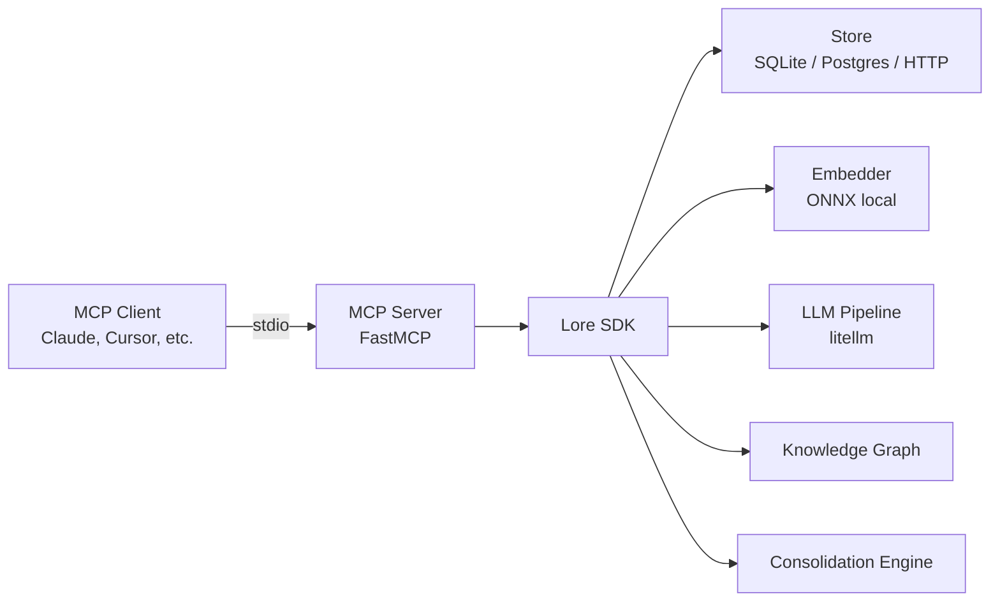
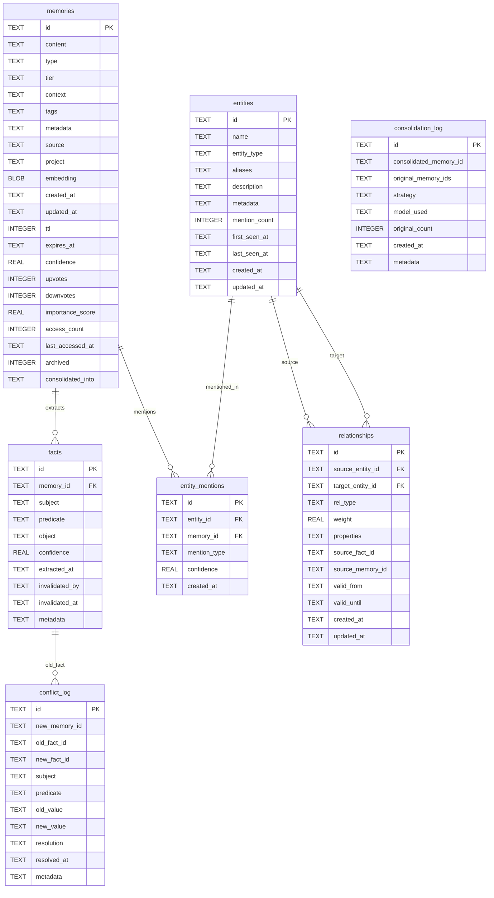
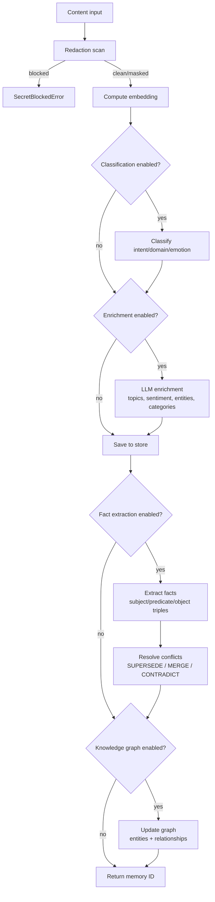
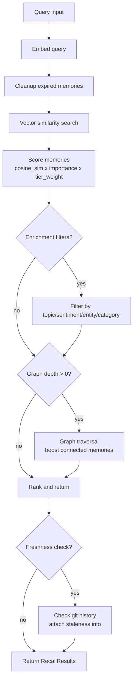

# Architecture

This document describes the internal architecture of Lore v0.6.0.

## Overview



An MCP client (Claude Desktop, Cursor, VS Code, etc.) communicates with the Lore MCP server over stdio transport. The MCP server is a thin wrapper around the Lore SDK, which orchestrates storage, embedding, LLM processing, and graph operations.

## Data Model



## Pipeline Flows

### remember() -- storing a memory



### recall() -- searching memories



## Storage Backends

### SQLite (default)

The default store. Data is stored in `~/.lore/default.db`. Zero configuration required.

- Full-text search via vector similarity (in-process cosine similarity on float32 embeddings)
- All tables in a single database file
- Automatic schema migration on startup

### PostgreSQL + pgvector

Used by the self-hosted server for multi-user deployments.

- Native vector similarity via pgvector extension
- Connection pooling via asyncpg
- Same schema as SQLite, adapted for PostgreSQL types

### HTTP (remote)

A thin client that delegates all operations to a remote Lore server over HTTP.

- Set `LORE_STORE=remote` with `LORE_API_URL` and `LORE_API_KEY`
- All embedding happens server-side
- Supports all operations except local-only features (freshness checking, graph backfill)

## Embedding

### ONNX Local Embedding (default)

Lore ships with a local ONNX embedding model (all-MiniLM-L6-v2, 384 dimensions). No API key or network access is needed for embedding.

- Model is loaded on first use and cached in memory
- Tokenization via HuggingFace tokenizers
- Runs on CPU via onnxruntime

### Dual Embedding

When `dual_embedding=True`, Lore uses two models:

- **Prose model:** all-MiniLM-L6-v2 for natural language
- **Code model:** A code-specific model for code snippets (with fallback to prose)

An `EmbeddingRouter` selects the appropriate model based on content heuristics.

### Custom Embedder

You can provide your own embedding function or embedder implementation:

```python
lore = Lore(embedding_fn=my_embedding_function)
# or
lore = Lore(embedder=my_custom_embedder)
```

## LLM Integration

All LLM features are opt-in. Without LLM configuration, Lore operates fully offline using local embeddings and rule-based classification.

LLM-powered features (via [litellm](https://github.com/BerriAI/litellm)):

| Feature | Description | Env Variable |
|---------|-------------|-------------|
| Enrichment | Topic extraction, sentiment analysis, entity recognition, categorization | `LORE_ENRICHMENT_ENABLED` |
| Classification | Intent, domain, and emotion classification | `LORE_CLASSIFY` |
| Fact Extraction | Structured (subject, predicate, object) triple extraction | `LORE_FACT_EXTRACTION` |
| Consolidation | LLM-generated summaries when merging memory clusters | Automatic when LLM is configured |
| Conflict Resolution | LLM-assisted fact conflict resolution | Automatic when LLM is configured |

All features use the same LLM configuration: `LORE_LLM_PROVIDER`, `LORE_LLM_MODEL`, `LORE_LLM_API_KEY`.

Enrichment has its own model config (`LORE_ENRICHMENT_MODEL`) for cost optimization -- you might use a cheaper model for high-volume enrichment.

## Knowledge Graph

The knowledge graph is an entity-relationship layer built on top of memories.

### Entities

Nodes in the graph. Types: `person`, `tool`, `project`, `concept`, `organization`, `platform`, `language`, `framework`, `service`, `other`.

Entities are extracted from:
- LLM enrichment results (entity recognition)
- Structured facts (subjects and objects)
- Co-occurrence analysis

Entities support aliases for deduplication (e.g., "React" and "ReactJS" map to the same entity).

### Relationships

Directed edges between entities. Types: `depends_on`, `uses`, `implements`, `mentions`, `works_on`, `related_to`, `part_of`, `created_by`, `deployed_on`, `communicates_with`, `extends`, `configures`, `co_occurs_with`.

Relationships have:
- **Weight** (0.0-1.0+): strength of the connection
- **Temporal validity** (`valid_from`, `valid_until`): relationships can expire when facts are superseded
- **Provenance** (`source_fact_id`, `source_memory_id`): tracks where the relationship came from

### Traversal

Graph queries use hop-by-hop traversal at the application level (not recursive SQL). The `GraphTraverser` class:

1. Starts from seed entities
2. Fetches relationships at each depth level
3. Collects connected entities
4. Computes a relevance score based on path weights

Maximum depth is capped at 3 to prevent expensive traversals.

## Consolidation

The consolidation engine reduces memory bloat by:

1. **Deduplication** -- merging near-identical memories (cosine similarity > 0.95)
2. **Summarization** -- clustering related memories and generating a concise summary (requires LLM)

Consolidation can run in dry-run mode (preview only) or execute mode (applies changes). When a memory is consolidated, it is archived (`archived=true`) and linked to the new consolidated memory (`consolidated_into`).

## Security

- All content passes through a redaction pipeline before storage
- Secrets (API keys, passwords, tokens) are detected and either masked or blocked
- Configurable security scan levels and action overrides
- Integration with `detect-secrets` for advanced secret detection (optional)

## Persistence layer

Lore's server-side persistence is defined by the `Store` protocol in
`lore.persistence.protocol`. The protocol defines eight slices:

- **MemoryOps** (Phase 1A): insert, get, update, delete, list, recall, expire, bump, vote operations on memories.
- **GraphOps** (Phase 1B): 24 typed methods spanning entity/mention/relationship management, graph traversal, stats, and a UI-facing text search.
- **PolicyOps** (Phase 1C): 7 typed methods for retrieval-profile CRUD + key-based resolution.
- **WorkspaceOps** (Phase 1D): 9 typed methods for workspace + workspace_member CRUD.
- **AuthOps** (Phase 1D): 5 typed methods for API key creation, listing, revocation, and root-key counting.
- **AnalyticsOps** (Phase 1E): 3 typed methods for retrieval-event recording, single-memory access tracking, and recent session-snapshot retrieval. Plus two extensions to MemoryOps: `bump_access_counts` (multi-row access bump) and `enrich_memory_meta` (jsonb_set for LLM enrichment data).
- **RecommendationOps** (Phase 1F): 4 typed methods for recommendation config get/upsert (NULL-safe via `IS NOT DISTINCT FROM`), feedback insert, and the candidate-memory query (top-N memories with embeddings, ordered by importance_score).
- **ConversationOps** (Phase 1G): 5 typed methods for the async conversation-extraction job lifecycle (create, get, mark processing, complete, fail). Plus one extension to MemoryOps: `import_extracted_memory` (idempotent INSERT … ON CONFLICT (id) DO NOTHING used by the conversation extraction flow).
- **MemoryOps extensions for lessons** (Phase 1H): 3 more methods on the existing MemoryOps slice — `list_memories_paginated` (count + paged rows with text-query and reputation filters), `list_memories_with_embeddings` (bulk export shape including the vector column), `upsert_memory_with_embedding` (idempotent INSERT … ON CONFLICT … DO UPDATE with org-guard, used by the lessons import flow). The lessons routes use these via field translation (problem↔content, resolution↔context) — no new Store group, since lessons ARE memories (the `lessons` Postgres view is a backward-compat wrapper added in migration 009).
- **AuditOps** (Phase 1I): 1 typed method (`query_audit_log`) for filtered audit log queries. Used by the `/v1/audit` dashboard endpoint.
- **AnalyticsOps extension for dashboards** (Phase 1I): 1 more method on AnalyticsOps — `compute_retrieval_analytics` collapses 7 separate SQL queries against `retrieval_events` into a single Store call returning a populated `RetrievalAnalyticsResult` dataclass. Used by `/v1/analytics/retrieval`.
- **RetentionOps** (Phase 1J): 10 typed methods spanning 3 tables (`retention_policies`, `snapshot_metadata`, `restore_drill_results`) — policy CRUD (5), latest snapshot lookup, snapshot count, drill recording, drill listing (joining policy → snapshots), and latest-drill-for-org. Used by `/v1/policies` (8 handlers including drill execution and cross-policy compliance reports).
- **SloOps** (Phase 1K): 7 typed methods on `slo_definitions` + `slo_alerts` — definition CRUD (5), alert listing, alert insertion. Used by `/v1/slo` (8 handlers).
- **AnalyticsOps extension for SLO** (Phase 1K): 2 more methods on AnalyticsOps — `compute_metric_value` (point-in-time SLO metric over a window) and `compute_metric_timeseries` (bucketed timeseries for charts). Both run against `retrieval_events` and own the metric→SQL mapping (lifted from the pre-1K `_metric_sql` helper).
- **SharingOps** (Phase 1L): 12 typed methods spanning 4 sharing tables (`sharing_config`, `agent_sharing_config`, `deny_list_rules`, `sharing_audit`) plus `memories`-touching ops — config get-or-init/update, agent-config list/upsert, deny-rule list/create/delete, audit list/record, sharing stats (count/last/event-summary), purge (5-table cascade in one tx, returns deleted count), and atomic `rate_lesson` (UPDATE memories.reputation_score + audit insert in one tx). Used by `/v1/sharing` (10 handlers) and `/v1/lessons/{id}/rate` (1 handler on a separately-mounted router).
- **AuthOps extensions for middleware** (Phase 1M): 2 more methods on AuthOps — `lookup_api_key_by_hash` (called on every authenticated request after the in-process cache miss) and `touch_api_key_last_used` (debounced last-used-at update). `StoredApiKey` gained an optional `role` field. Used by `lore/server/auth.py` middleware — the last component holding inline SQL has been migrated.

Implementations:

- `PostgresStore` — asyncpg + pgvector. Production default. Implements MemoryOps, GraphOps, PolicyOps, WorkspaceOps, AuthOps, AnalyticsOps, RecommendationOps, ConversationOps, AuditOps, RetentionOps, SloOps, and SharingOps.
- `SqliteStore` (Phase 3A skeleton + 3B vector layer + 3C MemoryOps insert/get/delete; remaining slices land across 3D–3F, bootstrap in 3G) — aiosqlite + sqlite-vec. For solo / embedded use. Currently: lifecycle (open/close/`_acquire`) + WAL pragmas (`journal_mode=WAL`, `synchronous=NORMAL`, `busy_timeout=5000`, `foreign_keys=ON`) + `sqlite-vec` extension load + migration runner reading `migrations_sqlite/` + `memory_vectors` vec0 virtual table for embeddings (created via `_init_vec_tables` after migrations apply, `IF NOT EXISTS` so idempotent across restarts) + `transaction()` async context manager (`BEGIN IMMEDIATE … COMMIT/ROLLBACK`) for the `memories` ⇆ `memory_vectors` invariant + the first three MemoryOps methods (`insert_memory`, `get_memory`, `delete_memory`) wired through that transactional pair. The remaining ~11 MemoryOps + AnalyticsOps + 6 other slices stay as `NotImplementedError` stubs pending 3D–3F. Schema lives in `migrations_sqlite/` (17 files mirroring `migrations/`); a CI parity guard (`scripts/check_migrations_parity.py`) rejects PRs that add a Postgres migration without a SQLite sibling.

The protocol is grown slice-by-slice. Phase 1A shipped `MemoryOps`; Phase 1B `GraphOps`; Phase 1C `PolicyOps`; Phase 1D `WorkspaceOps` + `AuthOps`; Phase 1E `AnalyticsOps`; Phase 1F `RecommendationOps`; Phase 1G `ConversationOps`; Phase 1H extended MemoryOps with lessons methods; Phase 1I added `AuditOps` and another AnalyticsOps extension for the dashboard bundle; Phase 1J added `RetentionOps`; Phase 1K added `SloOps` and another AnalyticsOps extension for SLO metric computation; Phase 1L added `SharingOps`; Phase 1M extended AuthOps for middleware. **Phase 1 route + middleware migration is complete**; Phase 3 (SqliteStore) is in flight.

Routes call services; services call the Store. Contract test suite at `tests/persistence/test_contract_*.py` is parametrized over every Store implementation (currently `[postgres, sqlite]`) — Postgres tests run inside a per-test transaction that is rolled back at teardown; SQLite tests open a fresh `:memory:` store per test. A `pytest_runtest_call` hookwrapper in `tests/persistence/conftest.py` converts SqliteStore-stub `NotImplementedError` (and a small set of asyncpg-only call patterns the helpers use for raw setup) into clean `pytest.skip("SqliteStore pending: …")` so the matrix is green pending each sub-phase landing more SqliteStore methods.

### Architectural invariants
1. Routes contain zero SQL. Services contain zero SQL. SQL lives only in Store implementations.
2. The Service layer is the only place business logic exists once. The HTTP front-end and the embedded API both call into services.
3. Backend chosen by `database_url` URL scheme. `LORE_BACKEND` env var is just a shortcut.

These invariants are guarded by `scripts/check_routes_no_sql.py` for the 22 migrated files (21 route files + the `auth.py` middleware). Phase 1M added `auth.py`. Every component in the request-handling path is now SQL-free; SQL is exclusive to Store implementations. The guard rejects reintroduction of inline SQL or `get_pool()` in any migrated file.
