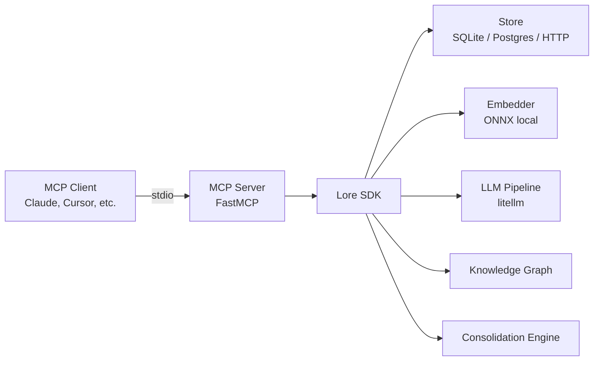
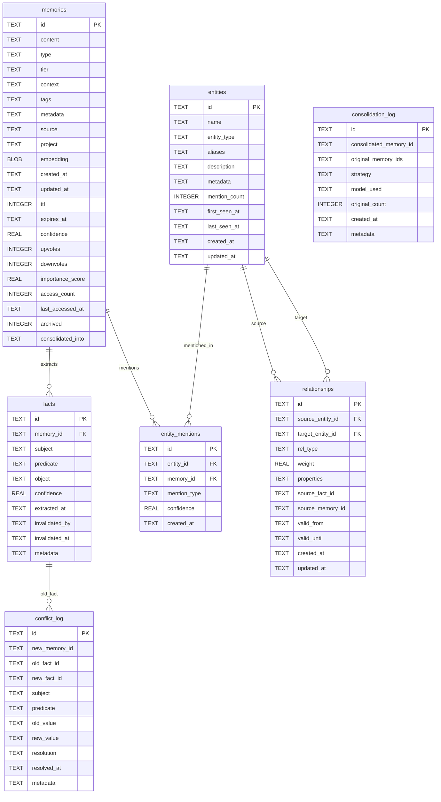
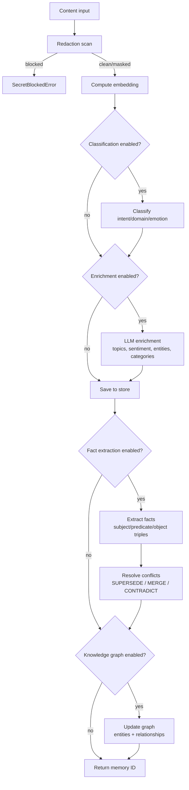
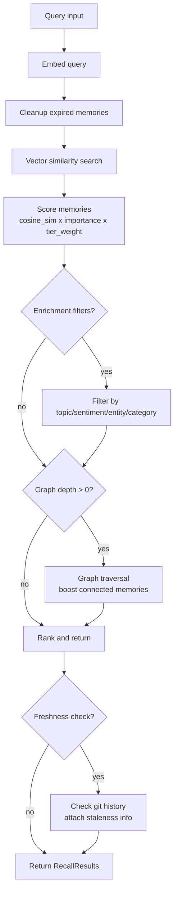

# Architecture

This document describes the internal architecture of Lore v0.6.0.

## Overview



An MCP client (Claude Desktop, Cursor, VS Code, etc.) communicates with the Lore MCP server over stdio transport. The MCP server is a thin wrapper around the Lore SDK, which orchestrates storage, embedding, LLM processing, and graph operations.

## Data Model



## Pipeline Flows

### remember() -- storing a memory



### recall() -- searching memories



## Storage Backends

### SQLite (default)

The default store. Data is stored in `~/.lore/default.db`. Zero configuration required.

- Full-text search via vector similarity (in-process cosine similarity on float32 embeddings)
- All tables in a single database file
- Automatic schema migration on startup

### PostgreSQL + pgvector

Used by the self-hosted server for multi-user deployments.

- Native vector similarity via pgvector extension
- Connection pooling via asyncpg
- Same schema as SQLite, adapted for PostgreSQL types

### HTTP (remote)

A thin client that delegates all operations to a remote Lore server over HTTP.

- Set `LORE_STORE=remote` with `LORE_API_URL` and `LORE_API_KEY`
- All embedding happens server-side
- Supports all operations except local-only features (freshness checking, graph backfill)

## Embedding

### ONNX Local Embedding (default)

Lore ships with a local ONNX embedding model (all-MiniLM-L6-v2, 384 dimensions). No API key or network access is needed for embedding.

- Model is loaded on first use and cached in memory
- Tokenization via HuggingFace tokenizers
- Runs on CPU via onnxruntime

### Dual Embedding

When `dual_embedding=True`, Lore uses two models:

- **Prose model:** all-MiniLM-L6-v2 for natural language
- **Code model:** A code-specific model for code snippets (with fallback to prose)

An `EmbeddingRouter` selects the appropriate model based on content heuristics.

### Custom Embedder

You can provide your own embedding function or embedder implementation:

```python
lore = Lore(embedding_fn=my_embedding_function)
# or
lore = Lore(embedder=my_custom_embedder)
```

## LLM Integration

All LLM features are opt-in. Without LLM configuration, Lore operates fully offline using local embeddings and rule-based classification.

LLM-powered features (via [litellm](https://github.com/BerriAI/litellm)):

| Feature | Description | Env Variable |
|---------|-------------|-------------|
| Enrichment | Topic extraction, sentiment analysis, entity recognition, categorization | `LORE_ENRICHMENT_ENABLED` |
| Classification | Intent, domain, and emotion classification | `LORE_CLASSIFY` |
| Fact Extraction | Structured (subject, predicate, object) triple extraction | `LORE_FACT_EXTRACTION` |
| Consolidation | LLM-generated summaries when merging memory clusters | Automatic when LLM is configured |
| Conflict Resolution | LLM-assisted fact conflict resolution | Automatic when LLM is configured |

All features use the same LLM configuration: `LORE_LLM_PROVIDER`, `LORE_LLM_MODEL`, `LORE_LLM_API_KEY`.

Enrichment has its own model config (`LORE_ENRICHMENT_MODEL`) for cost optimization -- you might use a cheaper model for high-volume enrichment.

## Knowledge Graph

The knowledge graph is an entity-relationship layer built on top of memories.

### Entities

Nodes in the graph. Types: `person`, `tool`, `project`, `concept`, `organization`, `platform`, `language`, `framework`, `service`, `other`.

Entities are extracted from:
- LLM enrichment results (entity recognition)
- Structured facts (subjects and objects)
- Co-occurrence analysis

Entities support aliases for deduplication (e.g., "React" and "ReactJS" map to the same entity).

### Relationships

Directed edges between entities. Types: `depends_on`, `uses`, `implements`, `mentions`, `works_on`, `related_to`, `part_of`, `created_by`, `deployed_on`, `communicates_with`, `extends`, `configures`, `co_occurs_with`.

Relationships have:
- **Weight** (0.0-1.0+): strength of the connection
- **Temporal validity** (`valid_from`, `valid_until`): relationships can expire when facts are superseded
- **Provenance** (`source_fact_id`, `source_memory_id`): tracks where the relationship came from

### Traversal

Graph queries use hop-by-hop traversal at the application level (not recursive SQL). The `GraphTraverser` class:

1. Starts from seed entities
2. Fetches relationships at each depth level
3. Collects connected entities
4. Computes a relevance score based on path weights

Maximum depth is capped at 3 to prevent expensive traversals.

## Consolidation

The consolidation engine reduces memory bloat by:

1. **Deduplication** -- merging near-identical memories (cosine similarity > 0.95)
2. **Summarization** -- clustering related memories and generating a concise summary (requires LLM)

Consolidation can run in dry-run mode (preview only) or execute mode (applies changes). When a memory is consolidated, it is archived (`archived=true`) and linked to the new consolidated memory (`consolidated_into`).

## Security

- All content passes through a redaction pipeline before storage
- Secrets (API keys, passwords, tokens) are detected and either masked or blocked
- Configurable security scan levels and action overrides
- Integration with `detect-secrets` for advanced secret detection (optional)
